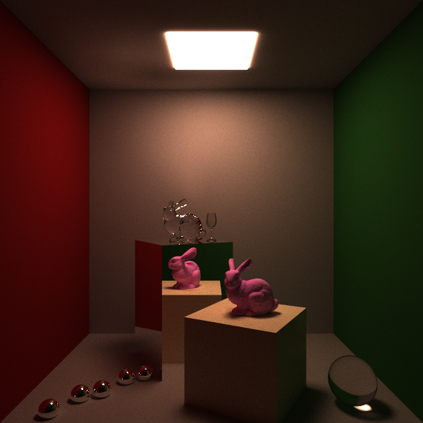
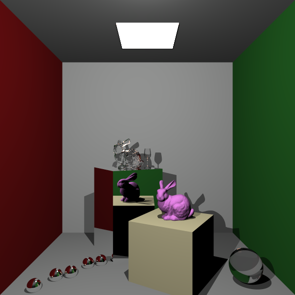

# Ray Tracer in C
## Table of Contents
- [Introduction](#introductionbackground)
- [Building and Running](#building-and-running-the-app)
- [Samples](#sample-outputs)
- [References](#references)

## Introduction/Background
This raytracer is an application to render a scene with objects and lighting. It was originally written in C# for a coursework assignment (30% of final mark) for the University of Melbourne subject COMP300019 (Graphics and Interaction), and has now been rewritten in pure POSIX C.

The scene is inputted using the json file and must have a light source. The application simulates the physics of light to generate output using the principles of linear algebra for light path tracing.

Since pure monte-carlo path tracing was applied (as opposed to bi-directional path tracing) for a more
natural look, the rendering time was very high. Considering the extreme computational intensity of the
application, the code was improved as it was being rewritten in C for a POSIX OS.

It has been built and tested on ubuntu/centos intel and MACOS (intel & M1).

The original C# project had other features such as camera orientation which are currently absent in
this project.

## Building and Running the App 
Ensure that the scene.json file and all the obj files are in the same directory. 

#### Build Command 
gcc -Wall -lm -lpthread -o raytracer FileUtils.c Scene.c Vector.c jsmn.c Render.c main.c

#### Libraries Required (Linux/Unix)
- math
- pthread

#### Input Flags
-i[input settings file path]  
-o[output ppm image file path]  
-x[rays per pixel side] (NOTE: rays per pixel is x<sup>2</sup>)  
-t[number of threads to be created]  
-q[valid entries are 1 (for basic render), 2 (for render with point lights only) and 3 (for higest quality render applying Monte-Carlo path tracing)]  
-w[width in pixels]  
-h[height in pixels]

 NOTE: there must not be any space between the flag and input supplied.

## Sample outputs
Output should be saved as a .ppm file since saving it as a .png requires an extra external library. 

###### Sample 1
This image was generated with a handcrafted linux/mac networked cluster with 22 CPU cores.  
This program was modified in a separate project to implement the cluster API.

The run command used to generate the image below (on an 8 core M1 Macbook) is:

```
./raytracer -x170 -q3 -t8 -iscene.json -orender_28900_rpp.ppm -w600 -h600
```

<p float="left">
  
</p>

###### Sample 2
The run command used to generate the image below (on an 8 core M1 Macbook) is:
```
./raytracer -x5 -q2 -t4 -iscene.json -otest_render_q2_25_rpp.ppm -w600 -h600
```

<p float="left">
  
</p>

## References
###### Code is proprietory unless expressly mentioned

Eternal Library:
Json Reader: The scene is inputted using a json file and the following json tokeniser was used:
https://github.com/zserge/jsmn

The University of Melbourne COMP30019 Sem 2 2022 Tutorial solutions: 
Creation of the virtual pixel screen, normalisation of pixel coordinates and firing of rays through pixel centres.  

Monte-Carlo path tracing algorithm and the inspiration for the display:
https://blog.demofox.org/2016/09/21/path-tracing-getting-started-with-diffuse-and-emissive/

Fresnel Refraction: 
From several internet sources including the above.

Generation of random vector direction in a hemispherical region:
http://mathworld.wolfram.com/SpherePointPicking.html

Parsing of Object files:
http://www.martinreddy.net/gfx/3d/OBJ.spec
https://github.com/stefangordon/ObjParser
Axis aligned bounding boxes and determining ray bound intersection algorithm:
from Book: Physically Based Rendering Third Edition 3.1.1 and 3.1.2
The program handles obj files with the RHS and converts them to the LHS system used.

Illumination and material colours: https://www.shadertoy.com/view/MtfGR4
